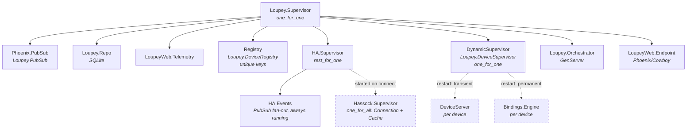

# Loupey Architecture

## Supervision Tree



Dashed lines indicate dynamically started children.

## Restart Policies

| Process | Restart | Rationale |
|---------|---------|-----------|
| Orchestrator | `:permanent` (supervised) | Always running. Serializes all device/profile/HA coordination. On crash, restarts and re-subscribes to PubSub. |
| HA.Supervisor | `:permanent` (supervised) | Always running. Events starts immediately; `Hassock.Supervisor` starts on demand via `HA.connect/1`. Strategy: `rest_for_one` — if Events crashes, the hassock tree restarts too so the fresh Events pid re-owns cache events. |
| Hassock.Supervisor | `:permanent` (dynamic child of HA.Supervisor) | Started when user provides HA config. Owns `Hassock.Connection` + `Hassock.Cache` under `one_for_all`. Hassock handles WebSocket reconnection internally. |
| HA.Events | `:permanent` (static child of HA.Supervisor) | Always running so PubSub subscribe helpers work before a connection exists. Pure fan-out: translates `{:hassock_cache, _, ...}` messages into `ha:connected` and `ha:state:*` broadcasts. Holds no state. |
| DeviceServer | `:transient` (dynamic child of DeviceSupervisor) | Only restarts on abnormal exit. If the device is unplugged (normal exit), stays dead. Reconnection is handled by the Orchestrator. |
| Bindings.Engine | `:permanent` (dynamic child of DeviceSupervisor) | Always restarts. On restart, loads the active profile from the database (not the stale child spec), re-subscribes to PubSub, and re-renders. |

## Engine Crash Recovery

When the Engine crashes and restarts via the DynamicSupervisor:

1. `init/1` loads the **active profile from the database** — not from the
   original child spec arguments, which may be stale after profile edits
2. Re-subscribes to `"device:{device_id}"` PubSub topic
3. Re-subscribes to `"ha:state:{entity_id}"` for each entity in the profile
4. Fetches current entity states from `Hassock.Cache` via the `Loupey.HA` facade
5. Sends `:render_active_layout` to re-render the display

If there's no active profile in the DB (deactivated while engine was running),
the engine enters idle state — it listens for events but renders nothing.
The Orchestrator can push a profile update via `Engine.update_profile/2`.

## HA Connection Lifecycle

The HA.Supervisor starts as a child of the Application supervisor in
"idle" state — only `Events` is running. The hassock tree is started
dynamically when `Loupey.HA.connect(config)` is called:

```
1. App starts → HA.Supervisor starts → Events starts (no cache yet)
2. Orchestrator.init subscribes to "ha:connected"
3. Orchestrator.init calls auto_connect_ha() from saved DB config
4. HA.connect(config) → HA.Supervisor.connect(config)
   → starts Hassock.Supervisor as dynamic child, with Events's pid
     as the cache controller
5. Hassock.Connection authenticates; Hassock.Cache transfers ownership
   and subscribes to all entities
6. Hassock.Cache loads the initial snapshot, sends
   {:hassock_cache, cache, :ready} to Events
7. Events broadcasts :ha_connected on the "ha:connected" topic
8. Orchestrator receives :ha_connected → connects devices + starts engines
```

Steady-state entity updates flow
`Hassock.Cache → {:hassock_cache, _, {:changes, _}} → Events →
{:ha_state_changed, ...}` on `ha:state:{id}` and `ha:state:all`.

On disconnect/crash:
- Hassock's internal `one_for_all` restarts Connection + Cache together
  on any crash within the hassock tree.
- If `Events` crashes, `HA.Supervisor` (rest_for_one) restarts the
  hassock tree too so the fresh Events pid owns the next cycle's cache
  events.

## Orchestrator

The Orchestrator is a GenServer that serializes all device/profile
coordination to prevent race conditions. It holds minimal state
(just `ha_ready` flag) — the source of truth is always the database.

**Messages handled:**
- `{:call, :connect_all_devices}` — discover and connect all devices
- `{:call, {:activate_profile, id}}` — deactivate all, activate one, start engines
- `{:call, {:deactivate_profile, id}}` — stop engines, mark inactive
- `{:cast, :reload_active_profile}` — reload from DB, push to engines
- `{:call, :status}` — return device/engine/profile status
- `{:info, :ha_connected}` — HA is ready, trigger device connection

**Startup sequence:**
1. Orchestrator starts, subscribes to `"ha:connected"` PubSub
2. Calls `auto_connect_ha()` which reads saved config from DB
3. When HA connects and sends `:ha_connected`, Orchestrator calls
   `do_connect_all_devices()` which discovers devices and starts engines

This replaces the old `Task.start(fn -> Process.sleep(2000) ... end)` pattern.

## PubSub Topics

All communication between processes goes through `Phoenix.PubSub` on
the `Loupey.PubSub` server.

| Topic | Publisher | Subscribers | Message Format |
|-------|-----------|-------------|----------------|
| `"device:{device_id}"` | DeviceServer | Engine, integration tests | `{:device_event, device_id, event}` where event is `PressEvent`, `RotateEvent`, or `TouchEvent` |
| `"ha:state:{entity_id}"` | Events | Engine | `{:ha_state_changed, entity_id, new_state, old_state}` |
| `"ha:state:all"` | Events | (available for future use) | `{:ha_state_changed, entity_id, new_state, old_state}` |
| `"ha:connected"` | Events | Orchestrator, Dashboard LiveView | `:ha_connected` |

PubSub subscriptions are automatically cleaned up when the subscribing
process dies (Phoenix.PubSub uses process monitors internally).

## Process Communication Flow

### Input Path: Device → HA

```
Physical Device
  │ raw UART bytes
  ▼
DeviceServer
  │ Driver.parse(raw) → [PressEvent | RotateEvent | TouchEvent]
  │ PubSub.broadcast("device:{id}", {:device_event, id, event})
  ▼
Bindings.Engine
  │ handle_info({:device_event, ...})
  │ Rules.match_input(event, binding, entity_state, control)
  │   → {:action, "call_service", params}
  │   → {:action, "switch_layout", %{layout: name}}
  │   → :no_match
  ▼
  ├─ call_service → Loupey.HA.call_service(ServiceCall)
  │                    → Task.Supervisor → Hassock.call_service → Home Assistant
  │
  └─ switch_layout → GenServer.cast(self, {:switch_layout, name})
                        → LayoutEngine.clear_all + switch_layout
                        → send_commands → DeviceServer → Device
```

### Output Path: HA → Device

```
Home Assistant
  │ WebSocket entity update (subscribe_entities)
  ▼
Hassock.Connection (WebSockex, owned by Hassock.Supervisor)
  │ parses frame, forwards to Hassock.Cache as {:hassock, conn, {:event, {:entities, _}}}
  ▼
Hassock.Cache
  │ applies diff to ETS, emits {:hassock_cache, cache, {:changes, %{added, changed, removed}}}
  ▼
HA.Events
  │ PubSub.broadcast("ha:state:{entity_id}", {:ha_state_changed, ...})
  │ PubSub.broadcast("ha:state:all", {:ha_state_changed, ...})
  ▼
Bindings.Engine
  │ handle_info({:ha_state_changed, entity_id, new_state, old_state})
  │ LayoutEngine.render_for_entity(layout, entity_id, new_state, spec)
  │   → Rules.match_output(binding, entity_state)
  │     → {:match, rule_idx, rule, render_instructions}
  │   → Renderer.render_frame(instructions, control)
  │   → [DrawBuffer | SetLED]
  │ dispatch_animations_for_entity → Ticker.start_animation / cancel_all
  ▼
DeviceServer
  │ Driver.encode(RenderCommand) → binary
  │ write to UART
  ▼
Physical Device (display updates)
```

## Animation Pipeline

The animation system layers a per-device tick loop on top of the
existing render path. Bindings without animation hooks render
through the direct path unchanged. Bindings *with*
`animation`/`animations`/`on_enter` hooks (or input rules with
`animation:` blocks) hand off to `Loupey.Animation.Ticker`, which
owns the in-flight state and drives a 30 fps tick loop.
`transitions`/`on_change` are not currently supported in YAML.

```
Bindings.Engine
  │ Rules.match_output → {:match, rule_idx, rule, instructions}
  │ Direct render: send DrawBuffer to DeviceServer (every match)
  │
  │ If rule has animation hooks AND last_match[control_id] transitioned:
  │   - cancel_all on previous control animations (rule_idx changed)
  │   - install rule.animations as :continuous
  │   - install rule.on_enter as :one_shot
  │
  ▼
Loupey.Animation.Ticker  (one per device, registered as {:ticker, device_id})
  │ tick loop @ 33ms cadence (monotonic-time-corrected, no backfill)
  │ per-control state: continuous + one_shots + base_instructions
  │ each tick:
  │   for each animated control:
  │     compute frame: lerp_keyframe(stops, eased_progress) per flight
  │     deep-merge frames over base_instructions
  │     Renderer.render_frame(merged, control)
  │     send DrawBuffer to DeviceServer.render
  │   refresh once per display
  ▼
DeviceServer → Device
```

The Ticker takes over rendering for animated controls until all
their animations complete. When animations finish, the next direct
render (on the next state change) re-renders the unanimated base.
On layout switch or profile update, `cancel_all_animations` drops
every Ticker animation for the device.

v1 only fires rule-transition `on_enter` (one-shot) and continuous
`animation`/`animations` (loop). Per-property `transitions` and
`on_change` ship in v2 alongside the engine's resolved-instructions
diff dispatcher.

The `IconCache` (`Loupey.Graphics.IconCache`) is essential for the
animation pipeline: composite-heavy tick loops trip
`pngload: out of order read` if icon images are re-used across
composites in their lazy form. The cache materializes thumbnailed
icons via `Vix.Vips.Image.copy_memory/1` and stores them in ETS
keyed by `{path, max_dim}`.

### Profile Activation Path

```
Web UI (ProfilesLive)
  │ "Activate" button click
  ▼
Orchestrator.activate_profile(profile_id)  (GenServer.call)
  │ 1. Deactivate all profiles (stop engines)
  │ 2. Mark profile active in DB
  │ 3. Load profile → Profiles.to_core_profile()
  │ 4. For each discovered device matching device_type:
  │    a. ensure_connected(device_id)
  │    b. start_or_update_engine(device_id, core_profile)
  ▼
DynamicSupervisor.start_child(Loupey.DeviceSupervisor, engine_spec)
  ▼
Bindings.Engine.init/1
  │ 1. Get DeviceSpec from DeviceServer
  │ 2. Subscribe to device events (PubSub)
  │ 3. Load profile (from arg or DB)
  │ 4. Subscribe to HA state changes for referenced entities
  │ 5. Fetch current entity states via Loupey.HA facade (Hassock.Cache)
  │ 6. Render active layout → send RenderCommands to DeviceServer
```

### Binding Save Path

```
Web UI (ProfileEditorLive)
  │ Save Binding (visual form or YAML)
  ▼
Profiles.create_binding() or update_binding()
  │ Persists YAML + entity_id to SQLite
  ▼
Orchestrator.reload_active_profile()  (GenServer.cast)
  │ Reloads profile from DB
  │ Profiles.to_core_profile() → core Profile struct
  ▼
Engine.update_profile(device_id, core_profile)
  │ GenServer.cast → handle_cast({:update_profile, profile})
  │ 1. Subscribe to any new entities
  │ 2. LayoutEngine.clear_all(spec) → clear all displays
  │ 3. render_active_layout() → re-render with new bindings
  ▼
DeviceServer → Device (display updates)
```

## API Boundaries

### Layer 1: Data (structs, no behavior)

| Module | Purpose |
|--------|---------|
| `Device.Spec` | What a device has (controls, capabilities) |
| `Device.Control` | Single physical control with capabilities |
| `Device.Display` | Pixel dimensions and format for a display control |
| `Events.PressEvent/RotateEvent/TouchEvent` | Normalized input events |
| `RenderCommands.DrawBuffer/SetLED/SetBrightness` | Normalized output commands |
| `HA.EntityState` | Snapshot of an HA entity's state |
| `HA.ServiceCall` | Request to call an HA service |
| `HA.Config` | HA connection configuration |
| `Bindings.Binding/InputRule/OutputRule` | Binding rules |
| `Bindings.Layout/Profile` | Layout and profile containers |

### Layer 2: Functional Core (pure functions)

| Module | Purpose | Key Functions |
|--------|---------|---------------|
| `Bindings.Expression` | `{{ }}` template evaluation | `eval/2`, `eval_condition/2`, `render/2`, `resolve/2` |
| `Bindings.Rules` | Rule matching | `match_input/4`, `match_output/2` |
| `Bindings.LayoutEngine` | Layout rendering | `switch_layout/4`, `render_layout/3`, `render_for_entity/4`, `clear_all/1` |
| `Bindings.YamlParser` | YAML ↔ struct conversion | `parse_binding/1`, `load_binding/2`, `parse_blueprint/1`, `instantiate_blueprint/2` |
| `Bindings.Blueprints` | Blueprint management | `list/0`, `get/1`, `instantiate/2` |
| `Graphics.Color` | Color parsing and RGB565 conversion | `parse/1`, `rgb_to_rgb565/1`, `rgb_binary_to_rgb565/1` |
| `Graphics.Format` | Vix image → device format | `to_device_format/2`, `to_rgb565/1`, `to_jpeg/1` |
| `Graphics.Renderer` | Compositing pipeline | `render_frame/2`, `render_solid/2` |
| `HA.Messages` | HA WebSocket protocol | `parse/1`, `encode_auth/1`, `encode_subscribe/2`, `encode_service_call/2` |
| `Profiles` | Profile context (DB + conversion) | `to_core_profile/1`, CRUD functions |

### Layer 3: Process Boundaries (GenServers, thin wrappers)

| Module | Type | Registered As | Purpose |
|--------|------|---------------|---------|
| `DeviceServer` | GenServer | `{Loupey.DeviceRegistry, device_id}` | UART I/O, event broadcasting, command encoding |
| `Bindings.Engine` | GenServer | `{Loupey.DeviceRegistry, {:engine, device_id}}` | Binding evaluation, layout management. Loads profile from DB on restart. |
| `HA.Events` | GenServer | `Loupey.HA.Events` | Fans hassock cache events into Loupey PubSub |

### Layer 4: Coordination and Web

| Module | Type | Purpose |
|--------|------|---------|
| `Orchestrator` | GenServer | Serializes device discovery, connection, profile activation, engine lifecycle. Subscribes to `ha:connected` for startup sequencing. |
| `Loupey.HA` | Module (facade) | Public API for HA integration (connect, disconnect, query, subscribe) |
| `Loupey.Devices` | Module (facade) | Public API for device discovery and connection |
| `Loupey.Settings` | Module (context) | Ecto context for HA config persistence |
| `Loupey.Profiles` | Module (context) | Ecto context for profile/layout/binding persistence |

## Driver Architecture

Drivers implement the `Loupey.Driver` behaviour:

```elixir
connect(tty, opts) → {:ok, connection_state}
disconnect(connection_state) → :ok
send_raw(connection_state, data) → :ok
parse(driver_state, raw_binary) → {driver_state, [Event.t()]}
encode(RenderCommand.t()) → {command_byte, payload_binary}
device_spec() → Spec.t()
matches?(device_info) → boolean()
```

The driver is a **pure I/O boundary** — it handles transport (UART, USB HID)
and protocol (WebSocket frames, HID reports) but has no business logic.
All decisions about what to render or what actions to take are made by
the functional core in the binding engine.

Currently implemented: `Driver.Loupedeck` (WebSocket over UART, 256kbaud).

## Touch Move Throttling

The Engine throttles `touch_move` events to prevent flooding HA with
service calls during slider dragging:

- `touch_start`: fires immediately
- `touch_move`: only fires if 400ms have elapsed since last send,
  otherwise stashes the latest params
- `touch_end`: flushes any stashed params (ensures final position is sent)

This is a simple time-check throttle with no timers — each event checks
`System.monotonic_time(:millisecond)` against `last_touch_move_at`.
